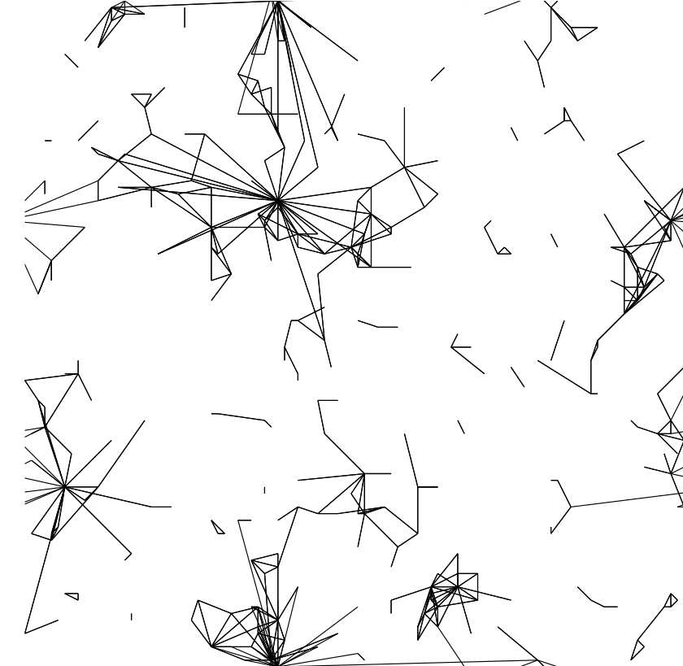

# Spatial preferential attachment model
<p align="center">
  
</p>


Here, you can find [python scripts](./spam.py) to plot the [spatial preferential attachment model](https://projecteuclid.org/euclid.aoap/1424355126).

This model embeds the classical preferential attachment model into a Euclidean space, thereby making it possible to create clustering effects. More precisely, the nodes </a> are uniformly distributed on the unit torus and as a new node </a> is born at time , it connects to any older node  independently with probability

<p align="center">
</a>
</p>

where   denotes the in-degree of  at time . The birth times are uniformly on the interval  and the parameter 0$" /> controls the strength of the bias towards . Moreover,  is a decreasing *profile function* whose integral is normalized to 1/2. For the plotting, we choose a power-law decay with exponent 1$" />: 

<p align="center">
</a>
</p>

## Tikz output
The script ``example.py`` allows you to generate a TikZ picture for the spatial preferential attachment model with  and .
To save a realization with 400 nodes and seed 48 into the 'pamPic.tex' run
```sh
python3 example.py 400 48 pamPic.tex
```
